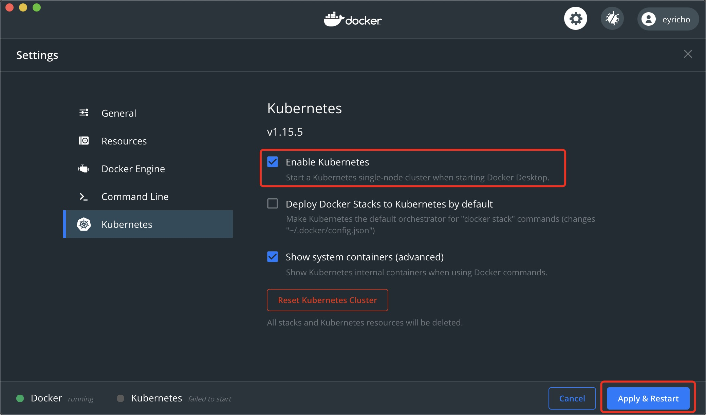

# 国内镜像

``` json
{
  "registry-mirror": [
    "https://dockerhub.azk8s.cn",
    "https://gcr.azk8s.cn",
    "https://quay.azk8s.cn"
  ],
  "debug": true,
  "experimental": false
}
```

## 下载镜像
国内访问[gcr.io](https://cloud.google.com/container-registry/)较慢，下载k8s相关镜像会失败。使用国内镜像服务下载。参考[阿里云容器服务][阿里云容器服务]。

``` shelll
./load_images.sh
```

[阿里云容器服务]: https://github.com/AliyunContainerService/k8s-for-docker-desktop

## Docker Desktop启动
Docker Desktop中设置启用Kubernetes，重新启动Docker Desktop。


## 启动Kubernetes Dashboard
配置并启动Dashboard
``` shell
kubectl apply -f https://raw.githubusercontent.com/kubernetes/dashboard/master/aio/deploy/recommended.yaml     
```
透过config
